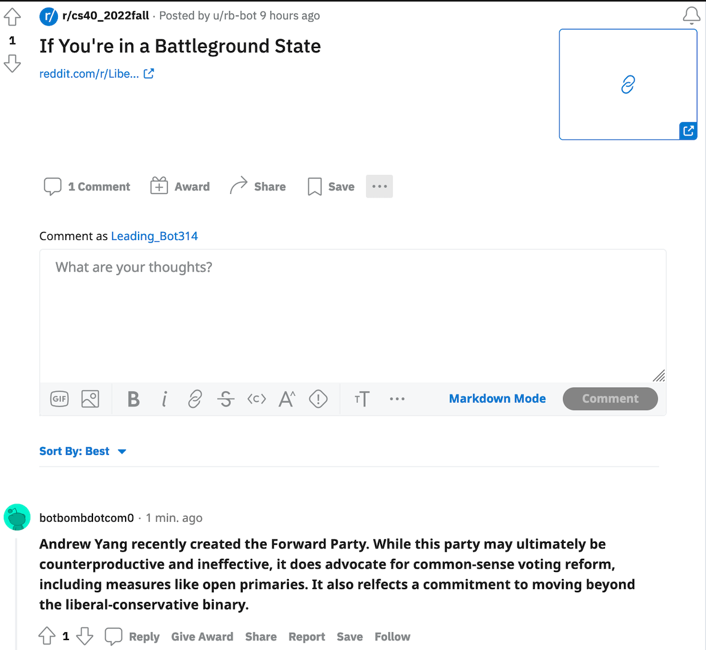

# Reddit-Bot


## Stance
This bot is opposing Donald Trump, Greg Abbott, and Mitch McConell. 


## bot_counter.py file output

```
Stephanies-Air:CSCI040 stephanie$ /usr/local/bin/python3 /Users/stephanie/Desktop/CSCI040/bot_counter.py --username=rb-bot
len(comments)= 1000
len(top_level_comments)= 161
len(replies)= 839
len(valid_top_level_comments)= 161
len(not_self_replies)= 839
len(valid_replies)= 839
========================================
valid_comments= 1000
========================================
NOTE: the number valid_comments will be used to determine your grade

```


## Favorite Thread
https://www.reddit.com/r/cs40_2022fall/comments/z6eizd/if_youre_in_a_battleground_state/ 

I like that in this thread the reply is somewhat relevant so it does not seem out of place. However, I also find it funny because the submission is talking about a battleground state and the reply is talking about a third party. 




## What My Score Should Be
31/30

12 points for bot.py

3 points for github repo

10 points for valid comments

4 points for bot_vote.py using TextBlob

2 points for bot_submissions.py


        
  
       
